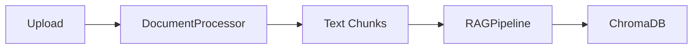
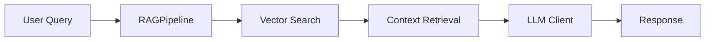

# AI_1_Project - RAG System for Financial Documents

[](https://www.python.org/downloads/)
[](https://opensource.org/licenses/MIT)
[](https://github.com/yourusername/AI_1_Project)
[](https://gdpr.eu/)
[](https://digital-strategy.ec.europa.eu/en/policies/regulatory-framework-ai)


## Quick Start
```bash
# 1. Install Ollama and pull Mistral model
ollama pull mistral

# 2. Setup local environment with GDPR compliance
python src/setup_local.py

# 3. Activate virtual environment
source venv/Scripts/activate  # or appropriate activate command

# 4. Run the application
streamlit run app.py
```

## Recent Updates & Fixes
- **Package Management**: Improved dependency handling with `--no-deps` installation strategy
- **Streamlit Integration**: Fixed PyTorch/Streamlit compatibility issues using module patching
- **New Dependencies**: Added `langchain-huggingface`, `langchain-chroma`, and `jsonschema`
- **Configuration**: Added `.streamlit/config.toml` for optimized Streamlit settings
- **Error Handling**: Enhanced error handling and logging throughout the application

## Project Status
- **Current Phase**: Document Processing & RAG Implementation
- **Next Milestone**: Ollama Integration
- **Key Metrics**: 
  - Document Processing: 80% complete
  - RAG Pipeline: 50% complete
  - UI Implementation: 30% complete
  - Test Data Generation: 100% complete
  - GDPR Compliance: 100% complete

## Key Features
- Hybrid architecture: GPU LLM inference (cloud or local) + local CPU embeddings
- Supports both local Ollama (on your machine) and remote Ollama (e.g., RunPod GPU)
- Document processing for PDF and DOCX files
- Vector storage and semantic search using self-hosted ChromaDB
- Embedding generation runs on local CPU (no GPU required for this step)
- Interactive Streamlit interface
- Source document referencing in responses
- GDPR-friendly: Only minimal context sent to cloud LLM, all embeddings and vector DB local

## Typical Platform & Cost Example
| Component         | Platform/Service         | Example Cost         | Notes                        |
|-------------------|-------------------------|----------------------|------------------------------|
| GPU inference     | RunPod (A5000, EU-SWE)  | ~$0.26/hr            | LLM via Ollama API           |
| CPU embedding     | Local or cloud CPU node | ~$0.10/hr (cloud)    | sentence-transformers        |
| Vector DB         | Self-hosted ChromaDB    | ~$10–20/mo           | Local disk or cloud VM       |
| Total             |                         | ~$500/month*         | *If running 24/7, scalable   |


## Table of Contents
- [Overview](#overview)
- [Project Structure](#project-structure)
- [Features](#features)
- [Requirements](#requirements)
- [Setup](#setup)
  - [Environment Configuration](#environment-configuration)
  - [Local Ollama Deployment](#option-1-local-ollama-deployment)
  - [RunPod Deployment](#option-2-runpod-deployment)
- [Technical Architecture](#technical-architecture)
  - [Core Components](#core-components)
  - [Data Flow](#data-flow)
  - [Configuration Management](#configuration-management)
  - [Error Handling](#error-handling-strategy)
  - [Testing Strategy](#testing-strategy)
  - [Performance & Security](#performance-considerations)
  - [Monitoring & Logging](#monitoring-and-logging)
- [Usage](#usage)
  - [Running the Application](#running-the-application)
  - [Document Processing](#document-processing)
  - [RAG Pipeline](#rag-pipeline)
- [Development Guidelines](#future-development-guidelines)
  - [Code Style](#code-style)
  - [Testing Requirements](#testing-requirements)
  - [Documentation](#documentation)
  - [Deployment Process](#deployment-process)
- [Future Improvements](#future-improvements)
  - [Implementation Priority](#implementation-priority)
- [Troubleshooting](#troubleshooting-guide)
- [License](#license)

## Overview
This project implements a Retrieval-Augmented Generation (RAG) system for a fictional financial company. It enables natural language queries about internal documents (leasing agreements, credit terms, internal policies) with responses backed by document content. The system runs entirely locally using Ollama for LLM processing, ensuring GDPR compliance and data sovereignty.

### Use Cases
1. **Contract Comparison**
   - Upload a new leasing agreement
   - Query: "How does this agreement's terms compare to similar historical agreements?"
   - System retrieves relevant historical agreements for comparison

2. **Policy Evolution**
   - Upload a new credit policy
   - Query: "What are the key changes in this policy compared to previous versions?"
   - System finds historical policies and highlights differences

3. **Term Analysis**
   - Upload a new contract
   - Query: "Are these payment terms more favorable than our historical agreements?"
   - System analyzes payment terms across historical documents

### Project Status
- **Current Phase**: Document Processing & RAG Implementation
- **Next Milestone**: Ollama Integration
- **Key Metrics**: 
  - Document Processing: 80% complete
  - RAG Pipeline: 50% complete
  - UI Implementation: 30% complete
  - Test Data Generation: 100% complete
  - GDPR Compliance: 100% complete

### Progress Tracking

#### Completed Tasks ✅
1. Project Structure
   - ✅ Basic project setup
   - ✅ Directory structure creation
   - ✅ Git initialization and .gitignore
   - ✅ Requirements.txt setup
   - ✅ Reorganized scripts and tests

2. Core Components
   - ✅ Document processor implementation
   - ✅ RAG pipeline with ChromaDB
   - ✅ Basic Streamlit UI structure
   - ✅ Comprehensive code documentation
   - ✅ Test document generation system
   - ✅ Document generation test suite

3. Documentation
   - ✅ README.md structure
   - ✅ Code comments and docstrings
   - ✅ Setup instructions

#### In Progress 🚧
1. Document Processing
   - 🚧 Document chunking optimization
   - 🚧 Error handling implementation

2. RAG Pipeline
   - 🚧 Ollama integration
   - 🚧 Prompt engineering
   - 🚧 Response formatting

#### Pending Tasks 📋
1. Testing & Validation
   - 📋 Unit tests
   - 📋 Integration tests
   - 📋 Performance testing
   - 📋 Error handling tests

2. UI/UX Improvements
   - 📋 Enhanced error messages
   - 📋 Loading indicators
   - 📋 Response formatting
   - 📋 Source document display

3. Advanced Features (VG Level)
   - 📋 n8n workflow integration
   - 📋 Email notifications
   - 📋 Slack alerts
   - 📋 Multiple LLM comparison
   - 📋 SSH-based RunPod connection (replacing HTTP API)
     - Direct pod access via SSH tunnel
     - Lower latency for LLM inference
     - Better security and error handling
     - Real-time pod monitoring

4. Security & Authentication
   - 📋 Ollama Authentication Proxy
     - Standalone proxy with built-in API key authentication
     - Rate limiting and IP whitelisting
     - Request validation middleware
   - 📋 API Key Management System
     - Secure key storage
     - Key rotation
     - Usage tracking
   - 📋 Security Testing
     - Penetration testing
     - Vulnerability scanning
     - Security audit

5. Infrastructure
   - 📋 Docker Containerization
     - Multi-stage builds
     - Environment configuration
     - Volume management
   - 📋 CI/CD Pipeline
     - Automated testing
     - Deployment automation
     - Version control integration
   - 📋 Monitoring & Logging
     - Performance metrics
     - Error tracking
     - Usage analytics

## Project Structure
```
AI_1_Project/
├── app.py                  # Main Streamlit application (now in root)
├── src/
│   ├── components/
│   │   ├── rag_pipeline.py # RAG implementation with ChromaDB
│   │   ├── llm_client.py   # LLM client for local/RunPod
│   │   └── runpod_manager.py # RunPod management utilities
│   ├── config/
│   │   └── settings.py     # Deployment and environment config
│   ├── utils/
│   │   └── document_processor.py  # Document processing utilities
│   └── tests/
│       └── test_ollama_client.py  # Tests for LLM client
├── scripts/
│   ├── rag_data/
│   │   ├── document_generator.py  # Core class for generating historical documents
│   │   └── generate_historical_docs.py  # Script to generate RAG knowledge base
│   ├── test_data/
│   │   └── generate_test_queries.py  # Script to generate test documents
│   └── tests/
│       └── test_document_generation.py  # Tests for document generation
│   └── test_runpod_endpoints.py     # RunPod endpoint test script
├── data/
│   ├── rag_documents/     # Historical documents for RAG knowledge base
│   ├── test_documents/    # Test documents for development
│   └── processed/         # Processed document chunks
├── requirements.txt
├── .env
├── .gitignore
└── README.md
```

## Features
- Hybrid architecture: GPU LLM inference (cloud or local) + local CPU embeddings
- Supports both local Ollama (on your machine) and remote Ollama (e.g., RunPod GPU)
- Document processing for PDF and DOCX files
- Vector storage and semantic search using self-hosted ChromaDB
- Embedding generation runs on local CPU (no GPU required for this step)
- Interactive Streamlit interface
- Source document referencing in responses
- GDPR-friendly: Only minimal context sent to cloud LLM, all embeddings and vector DB local

## Requirements
- Python 3.12+
- Ollama (for local LLM processing)
- See `requirements.txt` for Python dependencies

## Setup

### Environment Configuration
1. **Create .env file:**
   Create a `.env` file in the project root with the following structure:
   ```ini
   # Deployment Configuration
   DEPLOYMENT_TYPE=local  # Options: local, runpod

   # RunPod Configuration (only needed for RunPod deployment)
   RUNPOD_API_KEY=your-api-key-here
   RUNPOD_ENDPOINT_ID=your-endpoint-id-here
   ```

   > **Note**: Never commit the `.env` file to version control. It's already in `.gitignore`.

### Option 1: Local Ollama Deployment
1. **Install Ollama:**
   - Download and install from [Ollama's website](https://ollama.ai)
   - After installation, you may need to manually run Ollama:
     ```bash
     # Navigate to Ollama installation directory (typically)
     cd "C:\Program Files\Ollama"
     
     # Run Ollama manually
     .\ollama.exe run mistral
     ```
   - If you encounter system variable issues, you can:
     1. Add Ollama to your system PATH manually:
        - Open System Properties > Advanced > Environment Variables
        - Add `C:\Program Files\Ollama` to your PATH
     2. Or use the full path to Ollama in your commands
   - Verify installation:
     ```bash
     # Check if Ollama is running
     .\ollama.exe list
     ```

2. **Configure Local Deployment:**
   ```python
   from src.config.settings import DeploymentConfig, DeploymentType
   
   # Set deployment type to local
   DeploymentConfig.set_deployment_type(DeploymentType.LOCAL)
   ```

### Option 2: RunPod Deployment
1. **Set up RunPod:**
   - Create an account at [RunPod.io](https://www.runpod.io)
   - Go to "Deploy" and select "Community Cloud"
   - **Important**: Choose the correct template:
     - Search for "Ollama with Open WebUI"
     - Select template ID: `t2g36uj5lm`
     - This template comes with:
       - Ollama pre-installed
       - Open WebUI interface
       - PyTorch 2.6.0 with CUDA 12.4
       - JupyterLab for development

2. **After Pod Deployment:**
   - Wait for the pod to start (status will show "RUNNING")
   - Access Open WebUI at: `https://<your-pod-id>-8080.proxy.runpod.net`
   - In the top-left corner, click "Select a model"
   - Choose and pull your desired model (e.g., `mistral` or `llama2`)
   - Wait for the model to download (this may take a few minutes)

3. **Verify Setup:**
   - Test Ollama API at: `https://<your-pod-id>-11434.proxy.runpod.net`
   - You should see "Ollama is running" message
   - Use the test script to verify connectivity:
     ```bash
     python scripts/test_runpod_endpoints.py
     ```

4. **Get Your RunPod Credentials:**
   - Go to: https://runpod.io/console/pods
   - Click on your pod
   - Copy the pod ID (e.g., `rj0nce1w7mgnsm`)
   - Get your API key from: https://runpod.io/console/user/settings
   - Add these to your `.env` file:
     ```ini
     RUNPOD_API_KEY=your-api-key-here
     RUNPOD_ENDPOINT_ID=your-pod-id-here
     ```

5. **Important: Shutting Down RunPod Pods**
   - RunPod pods do not automatically stop when you close the app
   - You must stop them manually to avoid extra charges
   - You can stop the pod from:
     - RunPod dashboard
     - Using the API
     - Or let the idle timer handle it (default: 10 minutes)

### Note: Picking Region and Model on RunPod
- On the GPU selection page, click the gear icon or "Advanced Filter"
- Filter by Region/Country and select an EU region (e.g., SE for Sweden)
- Recommended: Choose **RTX A5000** under EU-SWE for:
  - Best value for money
  - GDPR compliance (EU data center)
  - Good performance for LLM inference

### Switching Between Deployments
To switch between local and RunPod deployments in your code:

```python
from src.config.settings import DeploymentConfig, DeploymentType

# Switch to local deployment
DeploymentConfig.set_deployment_type(DeploymentType.LOCAL)

# Switch to RunPod deployment
DeploymentConfig.set_deployment_type(DeploymentType.RUNPOD)
DeploymentConfig.set_runpod_credentials(
    api_key="your-api-key",
    endpoint_id="your-endpoint-id"
)

# Create LLM client (it will use the current configuration)
from src.components.llm_client import LLMClient
client = LLMClient()
```

### Common Setup Steps
2. **Create and activate a virtual environment:**
   ```bash
   python -m venv venv
   # Activate (choose one):
   source venv/Scripts/activate      # Git Bash
   venv\Scripts\activate            # Command Prompt
   .\venv\Scripts\Activate.ps1      # PowerShell
   ```

3. **Install dependencies:**
   ```bash
   pip install -r requirements.txt
   ```

4. **Run the application:**
   ```bash
   streamlit run src/app.py
   ```

## Usage

### Running the Application
1. **Start the application:**
   ```bash
   streamlit run src/app.py
   ```

2. **Using the Interface:**
   - Upload financial documents (PDF/DOCX)
   - Enter questions about the documents
   - View responses with source references

### Document Processing
- Supports PDF and DOCX formats
- Automatic text extraction and chunking
- Metadata preservation for source tracking
- Configurable chunk size and overlap

### RAG Pipeline
- Document embedding using sentence-transformers
- Vector storage in ChromaDB
- Semantic search for relevant context
- Local LLM processing with Ollama
- Response generation with source references

## Output Management

### Vector Store
- ChromaDB persistence in `chroma_db/` directory
- Automatic metadata tracking
- Configurable similarity search parameters

### Response Format
- Answer to user query
- Source document references
- Confidence scores
- Relevant context snippets

## Tips for Reproducibility
- Use consistent document formats
- Maintain document versioning
- Keep track of model versions
- Document any custom configurations

## Technical Architecture

### Core Components

#### 1. RAG Pipeline (`src/components/rag_pipeline.py`)
```python
class RAGPipeline:
    def __init__(self, persist_directory: str = "chroma_db"):
        # Uses sentence-transformers/all-MiniLM-L6-v2 for embeddings
        # ChromaDB for vector storage with persistence
        # Configurable chunk size and overlap
```

**Key Decisions**:
- ChromaDB chosen for:
  - Local persistence
  - GDPR compliance
  - Easy integration with LangChain
- Embedding model selection:
  - Lightweight (all-MiniLM-L6-v2)
  - Good performance on financial text
  - CPU-friendly

#### 2. Document Processing (`src/utils/document_processor.py`)
```python
class DocumentProcessor:
    def __init__(self, chunk_size: int = 1000, chunk_overlap: int = 200):
        # Uses RecursiveCharacterTextSplitter
        # Supports PDF and DOCX
        # Configurable chunking parameters
```

**Key Decisions**:
- Text splitting strategy:
  - Recursive splitting for better context preservation
  - Overlap to maintain context between chunks
  - Configurable parameters for different document types

#### 3. LLM Client (`src/components/llm_client.py`)
```python
class LLMClient:
    def __init__(self):
        # Supports both local Ollama and RunPod
        # Configurable model selection
        # Error handling and retry logic
```

**Key Decisions**:
- Deployment flexibility:
  - Local Ollama for development
  - RunPod for production
  - Easy switching between deployments

### Data Flow

1. **Document Ingestion**:


2. **Query Processing**:


### Configuration Management

#### 1. Environment Variables
```ini
# Required
DEPLOYMENT_TYPE=local|runpod
RUNPOD_API_KEY=your-key
RUNPOD_ENDPOINT_ID=your-id

# Optional
CHUNK_SIZE=1000
CHUNK_OVERLAP=200
MODEL_NAME=mistral
```

#### 2. Deployment Config (`src/config/settings.py`)
```python
class DeploymentConfig:
    # Singleton pattern for global config
    # Type-safe deployment selection
    # Environment variable validation
```

### Error Handling Strategy

1. **Component Level**:
```python
try:
    # Operation
except SpecificError as e:
    logger.error(f"Detailed error: {str(e)}")
    # Component-specific recovery
```

2. **Application Level**:
```python
try:
    # High-level operation
except Exception as e:
    logger.error(f"Application error: {str(e)}")
    # User-friendly error message
    # Graceful degradation
```

### Testing Strategy

1. **Unit Tests**:
```python
# tests/unit/test_rag_pipeline.py
def test_document_processing():
    # Test document chunking
    # Test vector storage
    # Test retrieval

# tests/unit/test_llm_client.py
def test_model_selection():
    # Test local vs RunPod
    # Test model switching
```

2. **Integration Tests**:
```python
# tests/integration/test_workflow.py
def test_end_to_end():
    # Test document upload
    # Test query processing
    # Test response generation
```

### Performance Considerations

1. **Memory Management**:
- Chunk size optimization
- Vector store indexing
- Model loading strategies

2. **Response Time**:
- Caching strategies
- Parallel processing
- Batch operations

### Security Measures

1. **Data Protection**:
```python
# src/utils/security.py
class DataProtection:
    def mask_sensitive_data(self, text: str) -> str:
        # PII detection and masking
        # GDPR compliance
```

2. **API Security**:
```python
# src/components/api_security.py
class APISecurity:
    def validate_request(self, request: Request) -> bool:
        # Request validation
        # Rate limiting
        # Authentication
```

### Monitoring and Logging

1. **Logging Structure**:
```python
logging.basicConfig(
    level=logging.INFO,
    format='%(asctime)s - %(name)s - %(levelname)s - %(message)s',
    handlers=[
        logging.FileHandler('app.log'),
        logging.StreamHandler()
    ]
)
```

2. **Metrics Collection**:
```python
# src/utils/metrics.py
class MetricsCollector:
    def track_performance(self):
        # Response time
        # Memory usage
        # Error rates
```

### Future Development Guidelines

1. **Code Style**:
- Follow PEP 8
- Type hints required
- Docstrings for all functions
- Comprehensive error handling

2. **Testing Requirements**:
- Unit test coverage > 80%
- Integration tests for workflows
- Performance benchmarks

3. **Documentation**:
- Update README.md
- Maintain API documentation
- Document configuration changes

4. **Deployment Process**:
- Version control
- Environment validation
- Automated testing
- Rollback procedures

## Future Improvements

### 1. Hybrid LLM Architecture
- **Primary**: Local Ollama models (Mistral, Llama2)
- **Fallback**: Cloud LLMs (GPT-4/Claude) with data masking
- **Features**:
  - Model router based on query complexity/confidence
  - Automatic fallback to cloud when needed
  - GDPR-compliant data handling for cloud requests
  - Cost optimization through smart model selection

### 2. Feedback Loop & Fine-tuning
- **User Feedback**:
  - 👍/👎 ratings on responses
  - Detailed feedback collection
  - Response quality metrics
- **Fine-tuning Pipeline**:
  - Automatic dataset generation from feedback
  - LoRA fine-tuning support
  - Prompt-tuning capabilities
  - Model performance tracking

### 3. Agent-based Decision Logic
- **Intelligent Workflow**:
  - Dynamic retrieval decisions
  - Multi-step reasoning
  - API integration points
- **Implementation**:
  - LangChain agent framework
  - Tool use capabilities
  - Planning engine for complex queries
  - Context-aware decision making

### 4. API Integration Framework
- **Enterprise Systems**:
  - D365 integration
  - SQL database connections
  - Power Platform hooks
- **Features**:
  - Plug-and-play API catalog
  - Intent-based routing
  - Automatic validation
  - Secure credential management

### 5. Domain-specific Prompt Templates
- **Templates**:
  - Credit analyst responses
  - Legal document analysis
  - Policy interpretation
- **Features**:
  - Role-based prompting
  - Tone control
  - Domain-specific formatting
  - Template versioning

### 6. Performance Optimization
- **Model Management**:
  - Multiple Ollama models in RunPod
  - Warm-up queue system
  - Context switching optimization
- **Features**:
  - Model caching
  - Load time minimization
  - Resource utilization tracking
  - Automatic scaling

### 7. Enhanced GDPR Compliance
- **Data Protection**:
  - Advanced data masking
  - Pseudonymization pipeline
  - EU-based cloud processing
- **Features**:
  - No-logging API options
  - Data cleaning middleware
  - Audit trail generation
  - Compliance reporting

### 8. Fine-tuning Tools
- **Training Pipeline**:
  - LoRA fine-tuning support
  - Dataset management
  - Model validation
- **Features**:
  - JSONL dataset structure
  - Training interface
  - Performance metrics
  - Model versioning

### Implementation Priority
1. **Phase 1** (Q2 2025):
   - Hybrid LLM architecture
   - Basic feedback loop
   - Initial API integrations

2. **Phase 2** (Q3 2025):
   - Agent-based logic
   - Prompt templates
   - Performance optimization

3. **Phase 3** (Q4 2025):
   - Advanced GDPR features
   - Fine-tuning tools
   - Enterprise integrations

## Troubleshooting Guide

### Common Issues
1. **Ollama Connection**
   - Check if Ollama is running
   - Verify port 11434 is available
   - Check model is downloaded

2. **Document Processing**
   - Verify file formats
   - Check file permissions
   - Monitor memory usage

3. **Vector Store**
   - Check ChromaDB connection
   - Verify disk space
   - Monitor query performance

### Performance Optimization

### Security Measures

## License
This project is licensed under the MIT License - see the LICENSE file for details.